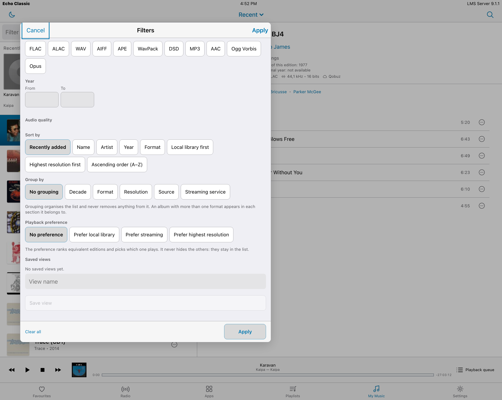
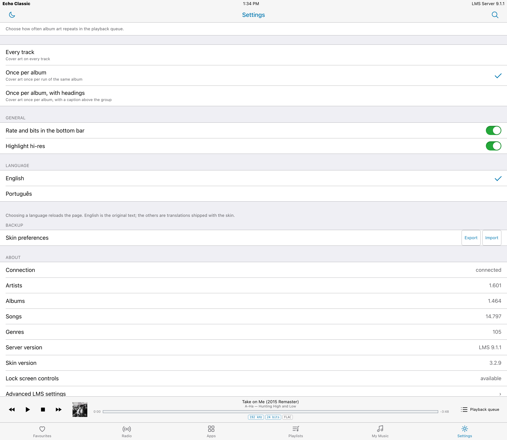

# Echo Classic

An iOS 9 iPad Music skin for [Lyrion Music Server](https://lyrion.org) (formerly Logitech Media Server).

Echo Classic shows the **native sample rate and bit depth of what actually reaches the DAC**, which is the reason it exists: on a hi‑fi setup you want to know at a glance whether the 24/96 file you paid for is being served untouched or quietly resampled somewhere in the chain.

It is Vue 2 with **no build step** — the files the server ships are the files the browser runs — and it needs LMS 8.0 or later.

**Current version: 3.2.9.** Every screenshot below was taken against the deployed 3.2.9 on a real server (LMS 9.1.1, 1,464 albums, 14,797 songs). None of them is a mockup.

---

## The library


Split view on wide screens: the list on the left, the album on the right. The album
header states what actually reaches the DAC — codec, sample rate, bit depth and where the
file comes from, Qobuz here rather than the local library. Credits are links, and every
row carries a `⋯` for the action sheet: play now, play next, add to queue, add to a
playlist, favourite, pin.

The root picker in the title bar switches between **Recent, Artists, Albums, Genres and
Years** and stays visible while you drill in, so you always know which root you are in.
Albums render as a track list or as a grid of large covers.

| | |
|---|---|
|  |  |
| **Filtering, sorting, grouping and playback preference** are four separate states in one adaptive panel, and the panel works as a draft — nothing is applied until you press Apply. | **Filters combine, and each is a removable pill.** Grouping adds section headers with counts and never drops a row from the list. |



*Playback preference decides what a tap actually plays when a work exists in several
editions — the remaster, the original, or whichever has the best resolution.*

## Themes

Three complete themes, not a colour swap. **Legacy** is an iOS 6 treatment: bevelled
chrome, a gradient title bar, glossy segmented controls and grouped tables.

| | |
|---|---|
|  |  |
| **Legacy** | **Dark**, with the hi‑res badge on every track above CD quality |


Seven accent schemes — System Blue, Atlantic Teal, Editorial Crimson, Studio Indigo,
Hi‑Fi Amber, Silver and Black — and five type choices. Every theme/accent combination is
contrast‑checked: 155 pairs, all passing WCAG AA.

## The players


There are three player surfaces: the **full player**, the **side panel** it opens into on
a wide screen, and the **bottom bar**. *Settings → Player layout* covers all of it in one
screen — whether the player opens adaptively or full screen, which side the panel takes,
and a single switch for appearance. Each surface can follow the app or carry its own
theme, accent and font; that lives behind **Customize player appearance**, one surface at
a time, so the basic decision stays the basic decision.

The playback queue is a popover with undo, per‑album artwork grouping and a counter that
reads as a sentence. Transport controls, a scrubber, volume with a row that says when the
DAC is doing the attenuation, sleep timer, crossfade, and lock‑screen controls through the
Media Session API.

## Everything else


**Playlists** are editable in place — rename, reorder, remove. **Favourites**, **Radio**
and **Apps** browse the server's own menus with in‑service search, so Qobuz, TuneIn and
whatever else you have installed appear as themselves rather than as a generic list.

**Global search** covers artists, albums, tracks and playlists — and keeps your query,
your results and your scroll position when you open a result and come back.

## Settings

| | |
|---|---|
|  |  |
| Player, playback, appearance and type on one scrollable screen — no tree of subscreens. | Queue artwork, hi‑res highlighting, language, preferences export/import, and an About block with live library counts. |

**LMS server settings are skinned inside the interface**, including a plugin manager with
status filters and counts, rather than dropping you onto a bare server page. The server's
own form stays authoritative — Echo Classic only dresses it, and Save goes through the
skin's own navbar.

## On a phone


Single column below 700px. The same filter panel becomes a full‑screen sheet with the
primary actions pinned to the bottom. Touch targets are 44×44 throughout and there is no
horizontal overflow at 390px.

## Language

The interface is written in English; other languages come from `strings.txt`, keyed by
the English phrase. **Portuguese ships today.** Pick a language under *Settings →
Language*: the LMS session language is the initial guess, and your choice there outranks
it, so a server running in one language can still show the skin in another. Adding a
language is an edit to one file, not a code change.

## Accessibility

- WCAG 2.1 AA contrast on all 155 theme/accent pairs, recomputed from the CSS tokens by a gate that fails the build
- Visible keyboard focus everywhere; segmented controls are real radiogroups with roving tabindex and arrow keys; popovers move focus in and hand it back on close
- 44×44 minimum touch targets
- No motion when the system asks for none

---

## Requirements

Lyrion Music Server 8.0 or later. Developed and verified against 9.1.1 on macOS.

## Install

**From the plugin repository** — add this under *Settings → Plugins → Additional
repositories*, then install **Echo Classic** from the list:

```
https://raw.githubusercontent.com/fdfreitas88/echoclassic/main/repo.xml
```

**Or manually** — copy the `EchoClassic` folder into the server's per‑user plugin
directory and restart the server:

| Platform | Plugin directory |
|---|---|
| macOS | `~/Library/Application Support/Squeezebox/Plugins` |
| Linux | `/var/lib/squeezeboxserver/Plugins` |
| Windows | `%APPDATA%\Squeezebox\Plugins` |

There is a helper for a local checkout:

```sh
tools/install-local.sh            # copies to the macOS path above
tools/install-local.sh /some/path # or to a directory you choose
```

Then open `http://<server>:9000/echoclassic/`, or pick **Echo Classic** in
*Server Settings → Interface* to make it the default skin.

The retired `/mojo` alias is intentionally not registered; it returns 404.

## Repository layout

```
EchoClassic/            the plugin, exactly as it is installed
  HTML/echoclassic/     the skin itself (index.html + html/js, html/css, html/lib)
  HTML/EN/plugins/...   the server-side settings page
  Plugin.pm             page registration, asset revision, player hint
  Settings.pm           server-side preferences
  strings.txt           every user-visible phrase, keyed by the English one
docs/                   screenshots, repository-submission notes, working briefs
tests/                  the node --test suite
tools/                  validation, screenshots, deploy and release scripts
```

`Plugin.pm` stamps every asset URL with the newest mtime under `HTML/echoclassic`.
That is deliberate: the server sends skin assets with `Cache-Control: max-age=604800`,
so without a revision a reinstall leaves the browser running last week's JavaScript
next to this week's CSS.

## Development

There is no build step. Edit the files, restart nothing, reload the page.

Before committing:

```sh
npm ci
npm test
npm run validate
npm run check-version
node tools/check-source-language.js
```

`validate` runs four gates: JavaScript syntax on every file, every Vue template compiled,
no orphaned cross‑module reference, and every WCAG contrast pair recomputed from the CSS
tokens across Light, Dark and Legacy. `check-source-language.js` fails if any Portuguese
interface text has been left outside `strings.txt`, where no dictionary could reach it.

`node tools/screenshots.js` regenerates the images above from the deployed skin.
Releases go through `tools/release.sh X.Y.Z`, which bumps the three manifests, asserts the
publication invariants, packages the zip, diffs it against the tree that produced it and
writes its SHA‑1 into `repo.xml`. Run it with `-n` first.

## Status

**3.2.9.** Gates on this release: 335 tests, 4/4 validation gates, 155/155 contrast pairs.

One thing this README should not oversell: **Podium Sans and Espy Sans fall back** to
Geneva/Verdana. Both are offered in Settings, but the font files are not bundled — that
waits on a licence decision. Chicago renders only where the system provides it.

[CHANGELOG.md](CHANGELOG.md) carries an evidence marker on every line — **[live]** for
something seen happening in the running interface, **[code]** for a chain read in the
source but not reproduced, **[measured]** for a number a named script produced. That
distinction is the point: it tells you, six months from now, which fixes can be trusted.

## Author

Felipe Freitas.

## Licence

GPL‑3.0‑or‑later. See [LICENSE](LICENSE).

Vue is bundled under `html/lib/` and carries its own MIT licence.
