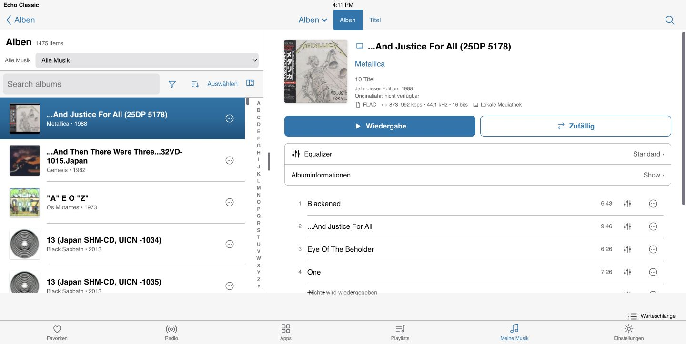
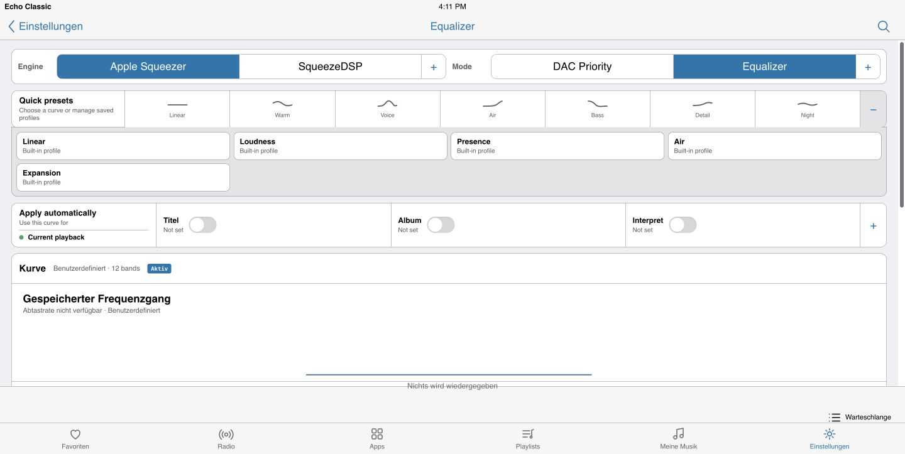
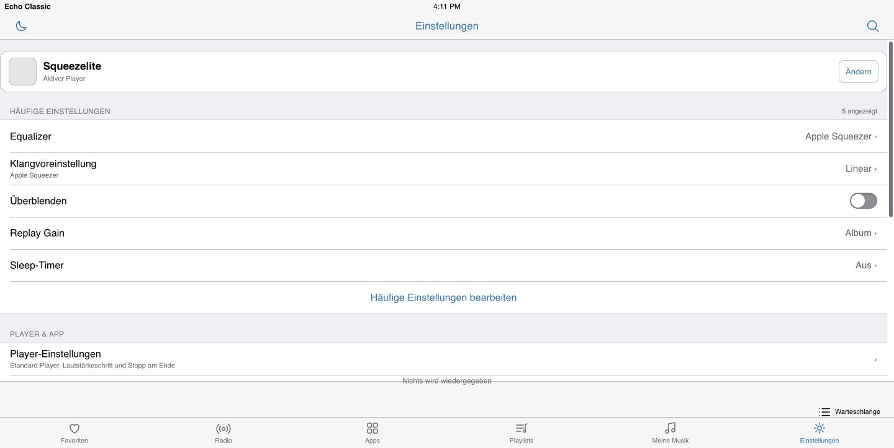

# Echo Classic

**A responsive Lyrion Music Server interface inspired by the clarity and
directness of the classic iPad Music app.**

[](https://github.com/fdfreitas88/echoclassic/releases/latest)
[](https://lyrion.org)
[](LICENSE)
[](https://patreon.com/fdfreitas88?utm_medium=unknown&utm_source=join_link&utm_campaign=creatorshare_creator&utm_content=copyLink)
[](https://buymeacoffee.com/fdfreitas)

Echo Classic turns Lyrion Music Server (formerly Logitech Media Server) into a
touch-friendly music system for tablets, phones and desktop browsers. It brings
library discovery, queue and playlist editing, synchronized-player control,
live signal-path information and optional server-side DSP into one interface.

Version **3.5.6-rc1** uses Vue 2 without a compilation or bundling step: the files in
the plugin are the files served to the browser.



## What is new in 3.5.4

### One full-width Equalizer workspace

Equalizer no longer moves between a narrow settings list and disconnected detail
pages. Engine selection, playback mode, quick presets, automatic rules, the
saved response curve and advanced processing now share one responsive workspace.
Every Equalizer entry point opens this same view and preserves its navigation
context.

Apple Squeezer and SqueezeDSP are presented as processing engines rather than
competing settings screens. DAC Priority, Equalizer, OSF and CSF are explicit
playback modes. If the current mode cannot process the saved curve, Echo Classic
keeps the curve visible and offers a direct way back to Equalizer mode.



The workspace includes:

- quick and saved sound profiles;
- a saved frequency-response preview;
- graphic and parametric equalization;
- preamp, headroom, Replay Gain and true-peak protection;
- balance, stereo width, delay, crossfeed and FIR convolution;
- contextual rules for a song, album, folder, artist, genre, year or epoch;
- momentary comparison with recoverable restore state;
- staged changes with validation, confirmation and rollback.

### Safer Apple Squeezer control

Echo Classic discovers Apple Squeezer through its versioned, capability-driven
LMS Store API. Mode changes show a blocking wait state while the audio path
restarts. OSF/CSF rate and filter choices update immediately, return to their
previous values if the server rejects the change, and invalidate cached status
after every mutation.

Native DSP state is scoped to the selected player and confirmed by revision.
Unsupported controls stay hidden, and missing telemetry is reported as
unavailable instead of being invented.

### Complete four-language runtime

All 801 runtime strings are complete in English, German, French and Portuguese.
The validation suite rejects missing translations, malformed blocks and duplicate
keys before a release can be packaged.

### Explicit failure and recovery states

Server and network failures no longer masquerade as empty lists or successful
actions. Queue, favourites, playlists, related artists, player settings,
playback intelligence, track information and Apple Squeezer diagnostics expose
their failure state or an actionable retry.

Settings import now requires a successful backup and rolls back every affected
key if a write fails. Malformed JSON-RPC envelopes, invalid paging values,
missing album identities and out-of-range queue positions fail safely. Responses
that arrive after the active player changes are discarded.

## Core features

### Library and discovery

- Adaptive split view on wide screens and a focused single column on phones.
- Recent, Artists, Album Artists, Albums, Tracks, Genres, Years and Release Types.
- Classical navigation through Composers, Conductors, Ensembles and Works.
- Recursive Music Folder browsing and switchable LMS virtual-library roots.
- Separate multi-disc sections and complete album track metadata.
- Combined filters for media type, source, year range and genre.
- Independent sorting, grouping and playback-edition preference.
- A–Z navigation for name-sorted roots, including Music Folder, without a false
  alphabet rail on chronological or numeric lists.
- Progressive album loading with a revision-checked local index; a stale index is
  rebuilt without replacing the visible library with a blocking skeleton.
- Local and streaming editions can be preferred by source or resolution without
  hiding the alternatives.
- Optional MusicArtistInfo biographies, photographs and album reviews with
  explicit loading, unavailable, refresh and retry states.

### Search

Global search covers artists, albums, classical works, tracks and playlists.
Advanced search adds year, source, format, release type, composer and work fields
and can run across one or several library roots. Results retain their provenance,
rank exact matches first and preserve the query and scroll position when a result
is opened.

### Playback and signal path

- Full player, wide-screen side player and persistent bottom player bar.
- Play, pause, stop, previous/next, seek, volume, sleep timer and stop at end.
- Crossfade and Off, Track, Album or Smart Replay Gain controls.
- Ratings and favourite actions where LMS supports them.
- Lock-screen and hardware controls through the Media Session API.
- Source codec, bitrate, sample rate, bit depth and hi-res indication.
- LMS 9.2 active-stream attributes after transcoding, kept separate from source
  metadata and shared by Now Playing, the bottom bar and Information sheet.
- Applied Replay Gain and explicit transcoding status without guessing missing
  DAC facts.
- RandomPlay and Don't Stop The Music provider selection with live active state.

On LMS 8.x and 9.1, Echo Classic falls back to track metadata. On LMS 9.2 it can
show the stream actually sent to the player's decoder, including deliberate
omission of bit depth when a lossless source is transcoded to MP3 or AAC.

### Players and synchronization

- Fast active-player switching and an optional default player.
- Synchronized group topology with master/member status and individual Unsync.
- Group volume with a per-member “Do Not Set Volume” policy.
- Correct handling of fixed-output players and external volume-control plugins.
- Configurable phone volume steps of 1, 2, 5 or 10 percent.
- Player-scoped playback, Equalizer and preference state protected from stale
  asynchronous responses.

### Queue and playlists

- Add, play next, insert, remove, clear upcoming and clear queue actions.
- Shuffle and Repeat remain primary; destructive actions live under Settings.
- Focused per-row action menus and optional persistent quick controls.
- Player-scoped undo after destructive queue edits.
- Artwork on every track, once per album or once with album headings.
- Drag-and-drop, edge movement and direct move-to-position.
- Playlist creation, rename, removal, filtering and reordering.
- One-step duplicate removal for saved playlists.
- Safe large-queue reads with an explicit warning if LMS cannot return the
  complete list.

### Favourites, Radio, Apps and pinned destinations

- Native LMS menus and service actions remain available instead of being reduced
  to a library-only model.
- In-service search and paged loading for providers such as Qobuz or TuneIn.
- Favourite creation/removal and favourite-folder management when advertised by
  the server.
- Pin, unpin and manually reorder destinations.
- Capability-gated commands: unsupported actions are hidden or explained.

### Appearance and responsive design

Echo Classic includes Light, Dark and Legacy visual treatments plus seven accent
schemes: System Blue, Atlantic Teal, Editorial Crimson, Studio Indigo, Hi-Fi
Amber, Silver and Black. The app, full player, side player and bottom bar can
follow one appearance or use independent theme, accent and font settings.

Below 700 px the interface becomes a single column, sheets use the full screen
and primary actions remain reachable. Touch targets are at least 44×44 px, long
translated labels wrap safely and the 390 px layout is checked for horizontal
overflow.

### Settings and server administration

Settings starts with user-curated Frequent Settings and groups the complete
surface into Player, Playback, Equalizer, Appearance, Queue, Interface & Access,
Backup and System destinations.



- Export and transactional import of skin preferences.
- Party mode hides destructive commands from casual users.
- Kiosk mode locks the player presentation and provides an administrator
  recovery path.
- Live connection, library-count, LMS-version and skin-version information.
- Native LMS settings embedded with Echo Classic navigation and Save controls.
- Responsive File Types table, scan progress and a bounded, redacted scan-error
  journal.
- Plugin manager with Active/Inactive views, search, counts and native LMS
  enable/disable controls.

### Accessibility

- Complete English, German, French and Portuguese runtime dictionaries.
- WCAG 2.1 AA validation across 155 Light, Dark and Legacy token pairs.
- Visible keyboard focus, dialog focus containment and focus restoration.
- Keyboard playback, seeking and volume controls in Now Playing.
- Semantic Shuffle/Repeat state and complete Now Playing metadata for assistive
  technology.
- Arrow-key radiogroups, labeled switches and dialogs, reduced-motion support and
  44×44 px touch targets.

## Optional integrations

- **Apple Squeezer** — lifecycle, playback modes, telemetry and player-scoped
  native DSP through its published Store API.
- **SqueezeDSP** — server-side graphic/parametric Equalizer, presets, contextual
  rules, signal controls and FIR processing.
- **MusicArtistInfo** — enriched artist biographies, photographs and album
  information.
- **Ratings Light** — plugin-aware rating reads and writes with a core LMS
  fallback when the plugin is absent.
- **RandomPlay / Don't Stop The Music** — capability-gated continuous-playback
  controls.

Echo Classic remains useful without any optional plugin; unsupported integration
surfaces are omitted or explain how to enable them.

## Requirements

- Lyrion Music Server 8.0 or later.
- A modern browser with JavaScript enabled.
- LMS 9.2 or later only for post-transcoding active-stream attributes.
- Optional plugins only for the integration features listed above.

Echo Classic is developed and tested primarily with LMS 9.x on macOS. It uses
normal LMS skin and JSON-RPC interfaces and is not macOS-only.

## Installation

### Plugin repository — recommended

In LMS, open **Settings → Plugins → Additional repositories** and add:

```text
https://raw.githubusercontent.com/fdfreitas88/echoclassic/main/repo.xml
```

Apply the LMS settings, find **Echo Classic**, install it and restart LMS when
requested. Future versions then appear through the LMS plugin updater.

Open:

```text
http://<your-lms-server>:9000/echoclassic/
```

You can also select Echo Classic under **Server Settings → Interface** to make it
the default web interface.

### Manual installation

Download the ZIP from the [latest release](https://github.com/fdfreitas88/echoclassic/releases/latest),
extract it and copy the resulting `EchoClassic` directory into the LMS plugin
directory:

| Platform | Typical plugin directory |
|---|---|
| macOS | `~/Library/Application Support/Squeezebox/Plugins` |
| Linux | `/var/lib/squeezeboxserver/Plugins` |
| Windows | `%APPDATA%\Squeezebox\Plugins` |

Restart LMS after copying the plugin.

For a local source checkout:

```sh
tools/install-local.sh
tools/install-local.sh /path/to/a/plugin-directory
```

The retired `/mojo` alias is intentionally not registered.

## Development

There is no build step. The installable plugin lives in `EchoClassic/`:

```text
EchoClassic/
  HTML/echoclassic/        browser interface
  HTML/EN/plugins/         server-side settings templates
  Plugin.pm                skin registration and asset revision
  Settings.pm              server-side preferences
  install.xml              LMS extension manifest
  strings.txt              runtime translations
images/                    screenshots used by this README
```

Maintainer-only specifications, tests and release tooling are kept outside the
public source tree. Published release ZIPs contain only the installable
`EchoClassic/` plugin directory.

`Plugin.pm` adds an asset revision based on the newest plugin file because LMS
caches skin assets aggressively. This prevents new JavaScript from running beside
an older cached stylesheet.

## Project status

Current release candidate: **3.5.6-rc1**.

- 542 automated tests passing.
- Five validation stages passing.
- 21 Vue templates compiling.
- 801 runtime strings complete in four languages with no duplicate keys.
- 155/155 tested contrast pairs passing.

The [changelog](CHANGELOG.md) distinguishes behavior verified in a running
interface (`live`), paths established in source (`code`) and values produced by a
named validation step (`measured`).

Podium Sans and Espy Sans currently fall back to Geneva/Verdana because their
font files are not distributed pending a licensing decision. Chicago renders
only on systems that provide it.

## Enjoying Echo Classic? ❤️

If Echo Classic makes your music system better, you can help support its
continued development. Every contribution helps keep the project actively
maintained.

You can support the project through:

<p>
  <a href="https://patreon.com/fdfreitas88?utm_medium=unknown&amp;utm_source=join_link&amp;utm_campaign=creatorshare_creator&amp;utm_content=copyLink"></a>
  <a href="https://buymeacoffee.com/fdfreitas"></a>
</p>

## Author and license

Created by Felipe Freitas.

Echo Classic is licensed under **GPL-3.0-or-later**. See [LICENSE](LICENSE).
The bundled Vue runtime retains its MIT license.
