# Echo Classic

**A modern, responsive Lyrion Music Server interface inspired by the clarity and
directness of the classic iPad Music app.**

[](https://github.com/fdfreitas88/echoclassic/releases/latest)
[](https://lyrion.org)
[](LICENSE)

Echo Classic turns Lyrion Music Server (formerly Logitech Media Server) into a
touch-friendly music system for tablets, phones and desktop browsers. It combines
fast library browsing, serious queue and playlist editing, classical-music
navigation, multi-library search, synchronized-player controls and an optional
server-side equalizer in one interface.

It also distinguishes the source track from the stream currently sent to the
player. With LMS 9.2, Now Playing can show the codec, bitrate, sample rate and bit
depth **actually in use after transcoding**—the closest server-side view of what
reaches the player's decoder and DAC. Older LMS releases automatically fall back
to the track metadata.

Echo Classic 3.5.2 uses Vue 2 and has no compilation or bundling step: the files in
the plugin are the files served to the browser.

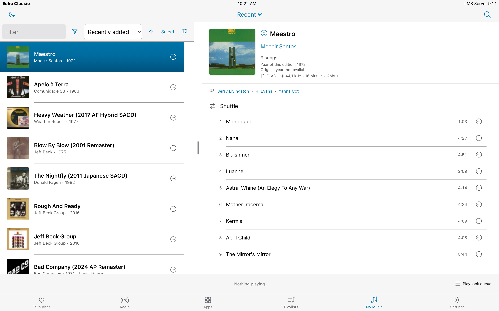

## Highlights in 3.5

### Playback telemetry and Signal Path

Echo Classic now treats playback information as a live signal chain rather than
only as file metadata. On LMS 9.2 it keeps separate source and active-stream
models, shows transcoding and applied Replay Gain, and deliberately omits bit
depth when a lossless source becomes MP3 or AAC. Now Playing, the bottom bar and
the Information sheet share the same live state and mark unavailable DAC facts
instead of guessing them.

### Apple Squeezer Store integration

Apple Squeezer is discovered as an independent LMS Store plugin through a
versioned, capability-driven API. When installed, Echo Classic can show its
lifecycle, start or restart it, select DAC Priority, Equalizer, OSF or CSF mode,
control upsampling and filter choices, and assign one confirmed DSP owner per
player to guard against processing the signal twice.

The native DSP surface includes graphic and parametric equalization, headroom,
Replay Gain, true-peak protection, spatial controls and FIR convolution. Changes
are validated before transmission, scoped to the selected player, confirmed by
revision and rolled back if the server cannot confirm the new state. Older
published Apple Squeezer releases remain supported through their released API,
with advanced controls hidden when the capability is absent.

### Mobile and externally controlled volume

Echo Classic honors LMS `use_volume_control`, so a player fixed at 100% can still
control an external Denon/Marantz-style amplifier when its plugin requests it.
The phone layout gives the slider the available width; both speaker icons are
volume buttons and the increment can be set to 1, 2, 5 or 10 percent.

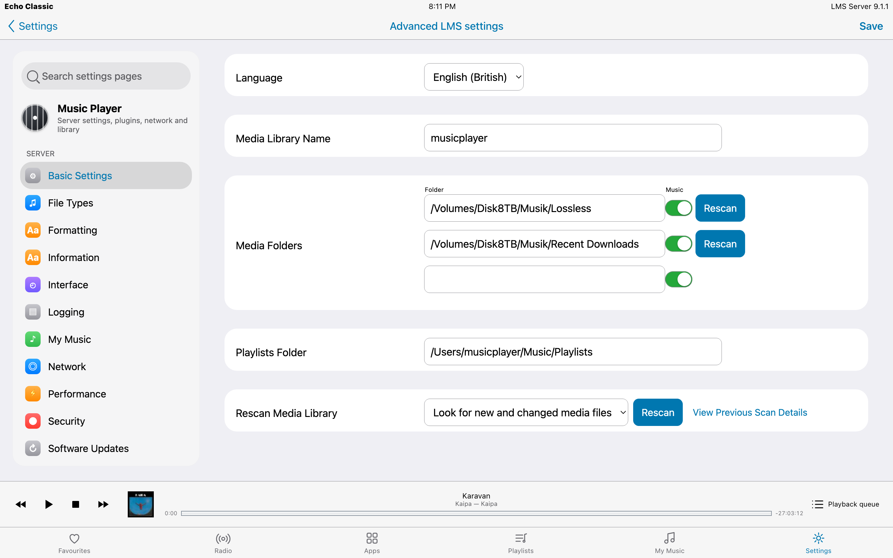

## Highlights in 3.4

### New in 3.4.1

Version 3.4.1 expands the SqueezeDSP integration from a graphic equalizer into a
complete responsive DSP control surface. It adds graphic-band Q, signal controls,
DSP ReplayGain, crossfeed, FIR room correction, editable shelf/pass/notch filters,
server preset creation and deletion, and separate graphic/full reset actions.
Legacy Echo EQ documents are migrated to SqueezeDSP's native `Slope` contract,
and unknown plugin fields are retained so newer SqueezeDSP versions remain safe
to edit. The release was verified against a running LMS/SqueezeDSP installation,
including staged changes, reset behaviour and the server-preset lifecycle.

### Server-side equalizer

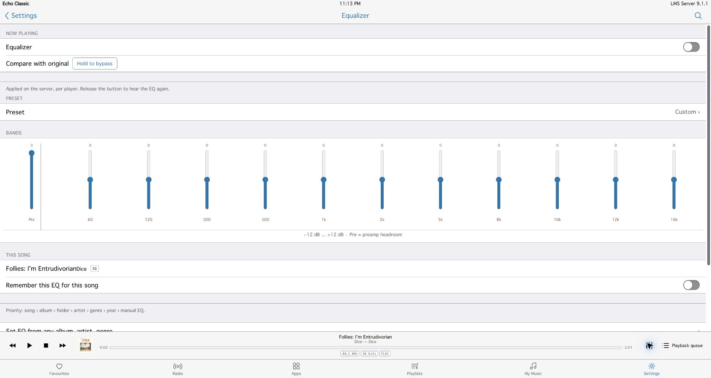

When [SqueezeDSP](https://github.com/Foxenfurter/SqueezeDSP) is installed, every
player gets a full graphic equalizer with preamp control, presets and momentary
bypass for comparing the processed and original signal. The EQ is available from
Settings, the player bar, album pages and individual track rows.

The advanced DSP panel also covers graphic-band Q, balance, stereo width, delay,
loudness, DSP-side ReplayGain, headphone crossfeed and FIR room correction.
Parametric filters include peak, low/high shelf, low/high pass and notch modes;
low shelf supplies dynamic-bass shaping and high shelf supplies treble
enhancement. Presets can be loaded, created and deleted directly from the skin,
and separate reset actions restore either the graphic bands or the complete DSP
document.

EQ settings can be remembered contextually for:

- an individual song or album;
- a music folder;
- an artist or genre;
- a release year or epoch;
- the active player as its manual fallback.

More-specific rules win: song → album → folder → artist → genre → year → manual
EQ. Settings are maintained separately for each player and complete SqueezeDSP
documents are written atomically.

### Library roots, folders and classical music

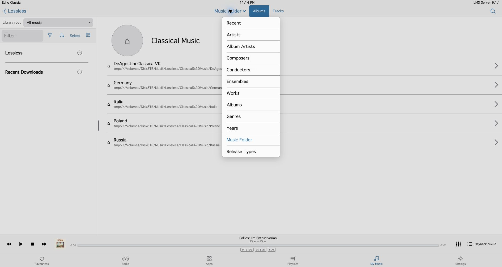

My Music now covers the full range of useful LMS entry points:

- Recent, Artists and the separate Album Artists view;
- Composers, Conductors, Ensembles and Works;
- Albums, Genres and Years;
- recursive Music Folder navigation;
- Release Types;
- All Music, LMS virtual libraries and top-level music folders as switchable
  library roots.

Each root keeps its own drill-down and scroll state. Albums retain server ordering
and multi-disc releases are separated into explicit Disc 1, Disc 2… sections.

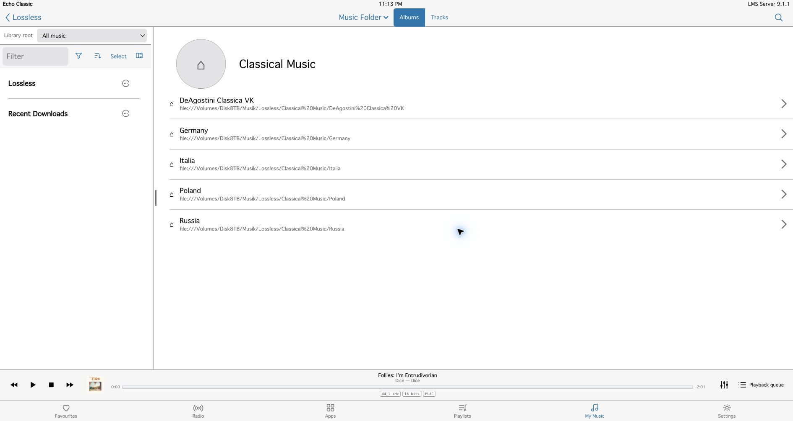

### Advanced, multi-root search

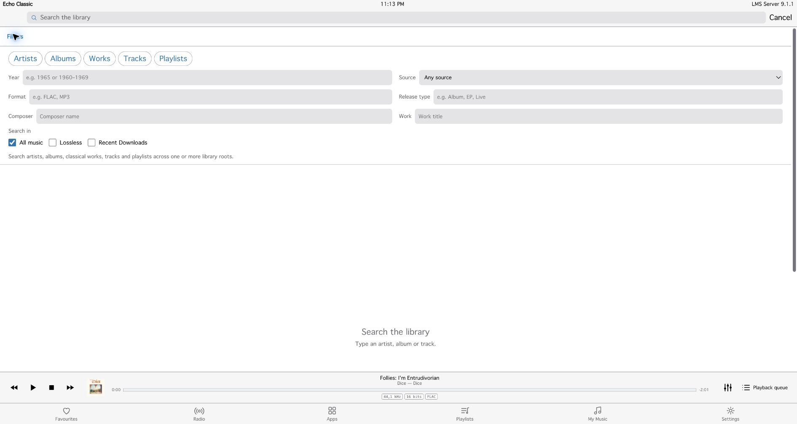

Global search covers artists, albums, classical works, tracks and playlists. Its
advanced panel adds year, source, format, release type, composer and work fields,
and a query can run across one or several library roots at once. Results retain
their root provenance, exact matches rank first, and opening a result no longer
throws away the query, result list or scroll position.

## Complete feature overview

### Library and discovery

- Adaptive split view on wide screens and a focused single-column layout on phones.
- Album lists, cover grids, track lists, Recent, Artists, Album Artists, Albums,
  Genres, Years and release-type navigation.
- Recursive Music Folder browser and switchable LMS virtual-library roots.
- Classical navigation through composers, works, conductors and ensembles when the
  library's tags and LMS metadata expose them.
- Explicit multi-disc album sections.
- Combined filtering by media type, source, year range and genre.
- Independent sorting, grouping and playback-edition preference.
- Section headers with counts, A–Z navigation where appropriate and virtualized
  long lists.
- Local and streaming editions can be preferred by source or resolution without
  hiding alternative editions.
- Optional MusicArtistInfo biographies, artist photographs, album reviews and
  refreshable bounded metadata caches.

| | |
|---|---|
| 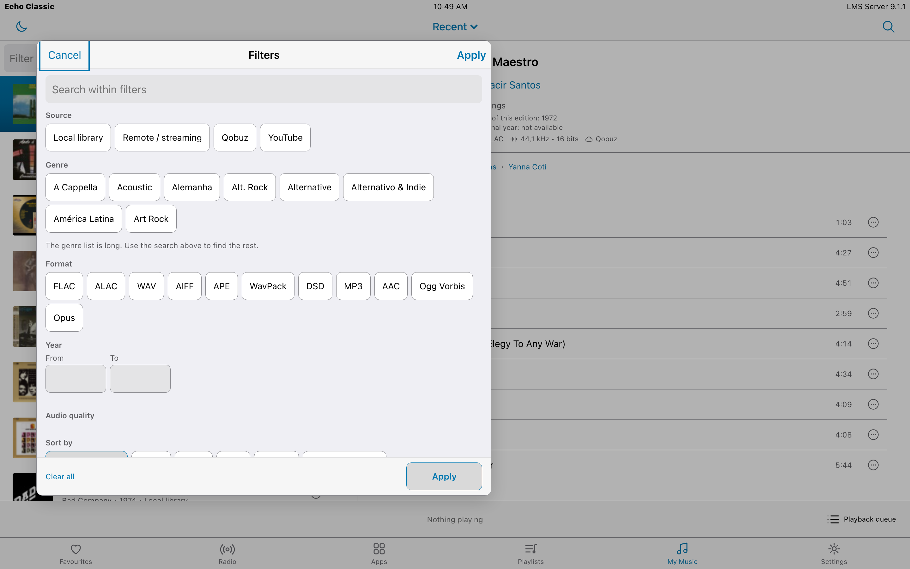 | 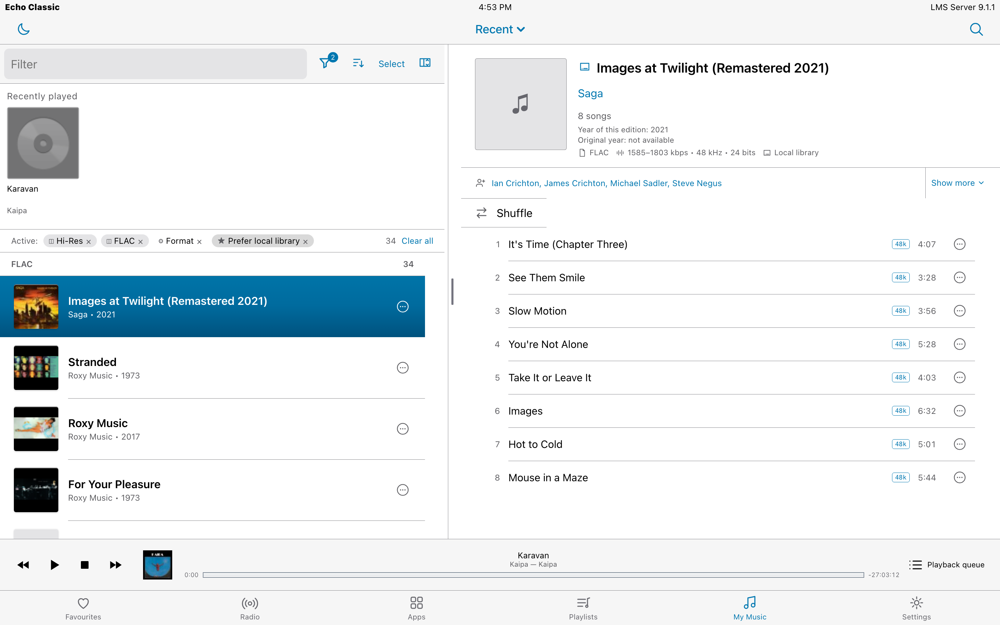 |
| Filters are staged until Apply and appear as individually removable pills. | Grouping creates real sections without dropping albums from the list. |

### Playback and audio information

- Full player, wide-screen side player and persistent bottom player bar.
- Play, pause, stop, previous/next, seeking, volume, sleep timer and stop-at-end.
- Crossfade/gapless controls and Off, Track, Album and Smart replay-gain modes.
- Ratings and favourite actions where supported by LMS.
- Lock-screen and hardware-media controls through the Media Session API.
- Codec, bitrate, sample rate, bit depth and hi-res highlighting.
- LMS 9.2 active-stream attributes after transcoding, with metadata fallback for
  LMS 8.x/9.1.
- SqueezeDSP equalizer with contextual per-song, album, folder, artist, genre and
  year/epoch rules.
- Complete SqueezeDSP signal controls, FIR impulse selection and strength,
  save/delete preset lifecycle, graphic-band Q and peak/shelf/pass/notch filter
  editing.
- RandomPlay and Don't Stop The Music provider selection with live active state.

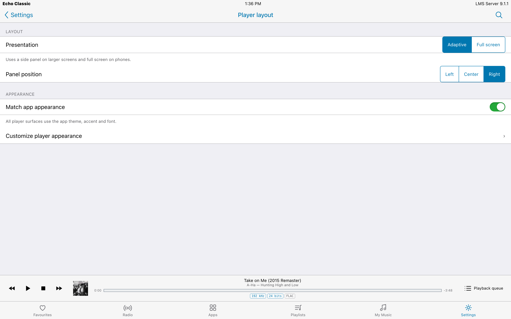

### Multiple players and synchronization

- Fast active-player switching and an optional default player.
- Synchronized-group status, master/member topology and individual Unsync.
- Group volume control.
- “Do Not Set Volume” policy for members that must keep their own level.
- Fixed-output players are excluded from inappropriate volume writes.
- Per-player playback, equalizer and preference state is protected from stale
  responses when the selected player changes.

### Queue and playlists

- Add, play next, insert, remove, clear upcoming and clear queue actions.
- Player-scoped undo after destructive queue edits.
- Queue artwork on every track, once per album, or once with album headings.
- Queue drag-and-drop and direct move-to-position.
- Saved-playlist rename, removal, arrow movement, move-to-position and drag-and-drop.
- One-step duplicate removal for saved playlists.
- Large queues are read safely before clearing, with an explicit warning if LMS
  cannot return the complete list.

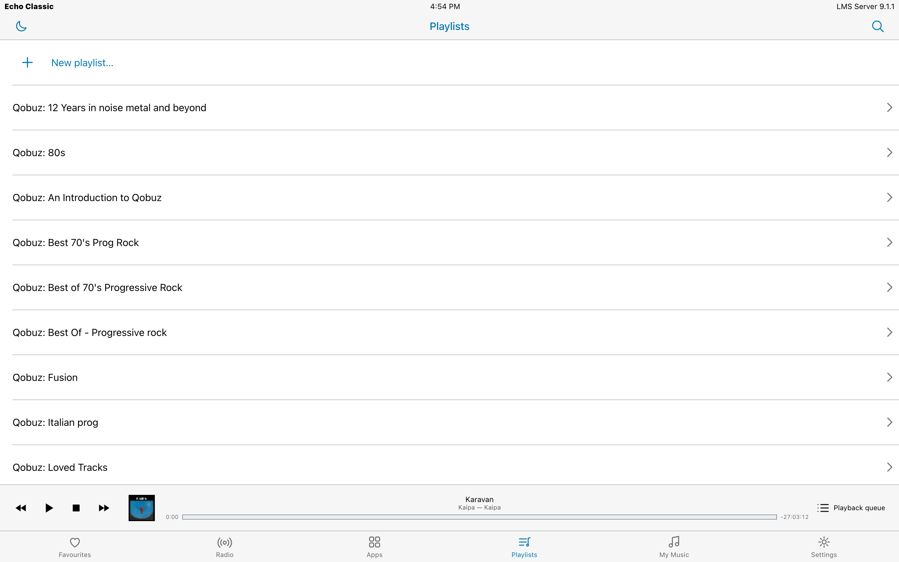

### Favourites, Radio, Apps and pinned destinations

- Native LMS menus and service actions are preserved instead of being flattened
  into a library-only model.
- In-service search and paged loading for large providers such as Qobuz or TuneIn.
- Favourite creation/removal plus favourite-folder creation, rename and movement
  when the server advertises the corresponding commands.
- Pin and unpin destinations, with manual pinned-item ordering.
- Capability-gated commands: unsupported server/plugin actions are hidden or
  explained instead of pretending to succeed.

### Shared-screen modes

- **Party mode** hides destructive library and playlist commands from casual users.
- **Kiosk mode** locks Echo Classic to its player presentation and provides an
  administrator recovery path.

### Appearance and responsive design

Echo Classic includes three complete visual treatments:

- **Light** — the clean iOS 9-inspired default;
- **Dark** — a full dark interface, not an inverted afterthought;
- **Legacy** — an iOS 6-style treatment with bevelled chrome and grouped tables.

Seven accent schemes are included: System Blue, Atlantic Teal, Editorial Crimson,
Studio Indigo, Hi-Fi Amber, Silver and Black. The app, full player, side player and
bottom bar can share one appearance or use independent theme, accent and font
settings.

| | |
|---|---|
| 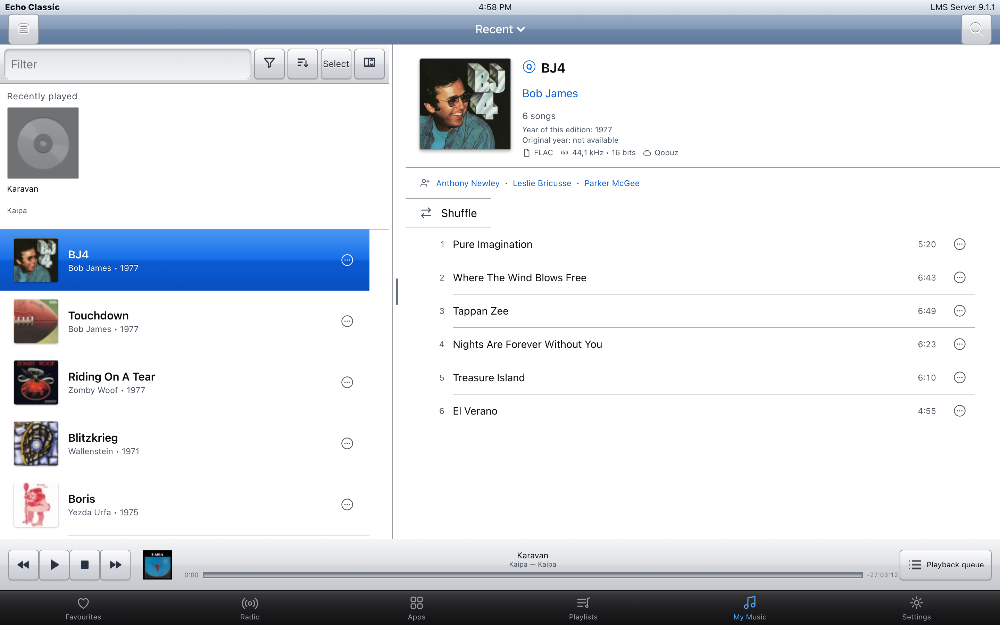 | 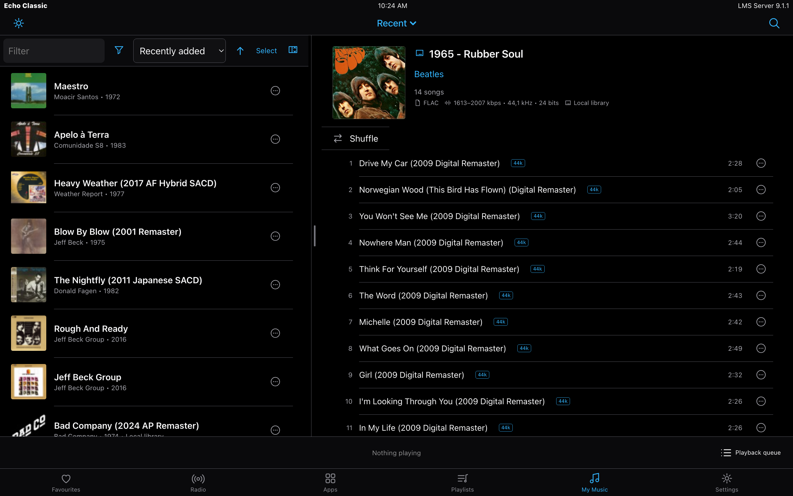 |
| Legacy | Dark with hi-res track badges |

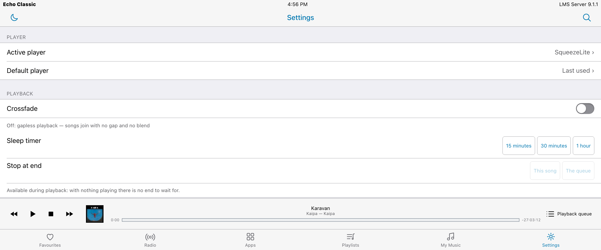

Below 700 px the interface becomes a single column, sheets use the full screen and
primary actions stay reachable. Touch targets are at least 44×44 px and the 390 px
layout is checked for horizontal overflow.

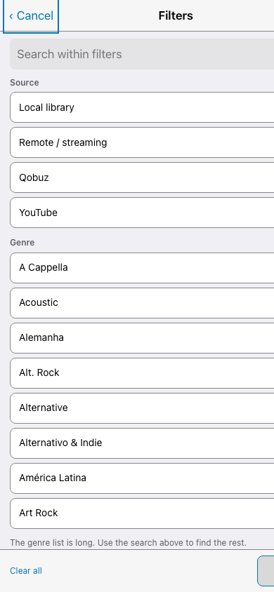

### Settings and server administration

- Player, playback, equalizer, queue, appearance, language and shared-screen
  preferences in one responsive settings surface.
- Export and import of skin preferences.
- Live connection, library-count, LMS-version and skin-version information.
- Native LMS settings embedded inside Echo Classic with its navigation preserved.
- Responsive File Types table, media-scan progress gauges and a bounded scan-error
  journal.
- Plugin manager with Active/Inactive status views, search, counts and the original
  LMS enable/disable controls.

| | |
|---|---|
| 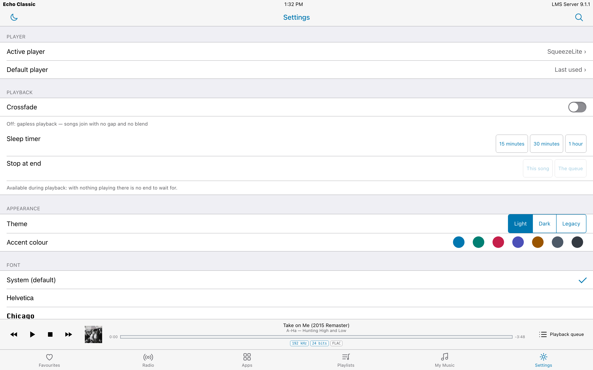 |  |
| Skin and playback settings | Native LMS administration inside Echo Classic |

### Language and accessibility

- English source interface and a complete Portuguese translation in `strings.txt`.
- Per-skin language selection can differ from the LMS session language.
- WCAG 2.1 AA contrast checks across 155 Light, Dark and Legacy token pairs.
- Visible keyboard focus, dialog focus containment and focus restoration.
- Radiogroups with arrow-key navigation and correctly exposed listboxes, switches
  and dialogs.
- Reduced-motion support and 44×44 px touch targets.

## Requirements

- Lyrion Music Server 8.0 or later.
- A modern browser with JavaScript enabled.
- LMS 9.2 or later for post-transcoding active-stream attributes. The rest of Echo
  Classic remains compatible with LMS 8.x and 9.1.
- SqueezeDSP is optional and required only for the equalizer.
- MusicArtistInfo is optional and used only for enriched artist/album information.

Echo Classic is developed and tested primarily with LMS 9.x on macOS, but the
plugin uses the normal LMS skin and JSON-RPC interfaces and is not macOS-only.

## Installation

### Plugin repository — recommended

In LMS, open **Settings → Plugins → Additional repositories**, add:

```text
https://raw.githubusercontent.com/fdfreitas88/echoclassic/main/repo.xml
```

Apply the LMS settings, find **Echo Classic** in the plugin list, install it and
restart LMS when requested. Future published versions then appear through the LMS
plugin updater.

Open:

```text
http://<your-lms-server>:9000/echoclassic/
```

You can also choose Echo Classic under **Server Settings → Interface** to make it
the default web interface.

### Manual installation

Download the ZIP from the [latest release](https://github.com/fdfreitas88/echoclassic/releases/latest),
extract it and copy the resulting `EchoClassic` directory into the LMS plugin
directory:

| Platform | Typical plugin directory |
|---|---|
| macOS | `~/Library/Application Support/Squeezebox/Plugins` |
| Linux | `/var/lib/squeezeboxserver/Plugins` |
| Windows | `%APPDATA%\Squeezebox\Plugins` |

Restart LMS after copying the plugin.

For a local source checkout:

```sh
tools/install-local.sh
tools/install-local.sh /path/to/a/plugin-directory
```

The retired `/mojo` alias is intentionally not registered.

## Development

There is no build step. The installable plugin lives in `EchoClassic/`:

```text
EchoClassic/
  HTML/echoclassic/        browser interface
  HTML/EN/plugins/         server-side settings templates
  Plugin.pm                skin registration and asset revision
  Settings.pm              server-side preferences
  install.xml              LMS extension manifest
  strings.txt              translatable interface strings
docs/                      screenshots, specifications and release evidence
tests/                     Node test suite
tools/                     validation, deployment, screenshot and release tools
```

Install dependencies and run the complete local gates:

```sh
npm ci
npm test
npm run validate
npm run check-version
node tools/check-source-language.js
```

`npm run validate` checks every JavaScript file, compiles every Vue 2 template,
detects orphaned cross-module references and recomputes all theme contrast pairs.
Release packaging goes through `tools/release.sh X.Y.Z`, which synchronizes the
three version manifests, builds the ZIP, compares the archive to the tested tree
and writes the exact SHA-1 into `repo.xml`.

`Plugin.pm` adds a revision to asset URLs based on the newest plugin file. This is
intentional: LMS caches skin assets aggressively, and a revision prevents a new
JavaScript file from running beside an older cached stylesheet.

## Project status

Current release: **3.5.2**.

- 497 automated tests passing.
- Four validation stages passing.
- 20 Vue templates compiling.
- 155/155 tested contrast pairs passing.

The [changelog](CHANGELOG.md) distinguishes features verified in a running
interface (`live`), paths established in source (`code`) and values produced by a
named validation step (`measured`).

Podium Sans and Espy Sans currently fall back to Geneva/Verdana because their font
files are not distributed pending a licensing decision. Chicago renders only on
systems that provide it.

## Author and license

Created by Felipe Freitas.

Echo Classic is licensed under **GPL-3.0-or-later**. See [LICENSE](LICENSE).
The bundled Vue runtime retains its MIT license.
